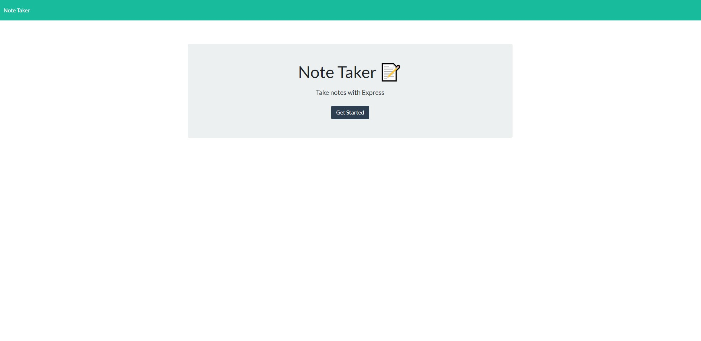
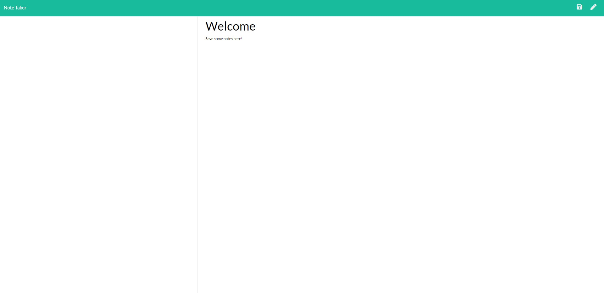

# Note-Saver

## Table of Contents:
  1. [Description](#Description)
  2. [Usage](#Usage)
  3. [Contributing](#Contributing)
  4. [Tests](#Tests)
  5. [Github](#Github)
  6. [E-mail](#E-mail)

## Description
An application that can be used to write, save and delete notes. The application uses an express backend and filesystem to save and retrieve noted from a JSON file. The notes are routed from the backend and rendered to an HTML page on the frontend for the client. 

## Usage
(1) Enter a title and a note into the note taker. 
(2) Click the disk/save icon to save your note.
(3) To delete a note, click the garbage can/delete icon next to the note.
(4) If you're in a note and wish to start writing a new note, click the pencil in the top right corner.

## Contributing
Pull requests are welcome. For major changes, please open an issue first to discuss what you would like to change. 

## Tests 
Please make sure to update tests as appropriate.

## Github
[ShannonDukes](https://github.com/ShannonDukes)

## E-mail
mrs.knit.wit.dukes@gmail.com